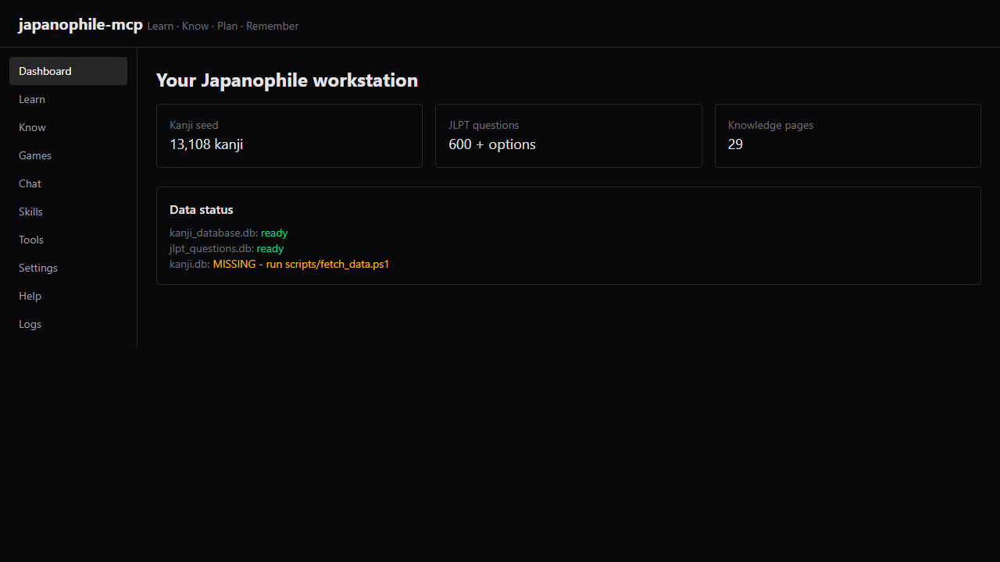
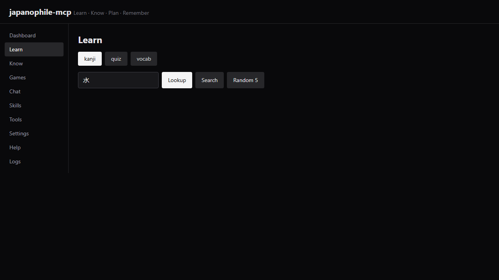
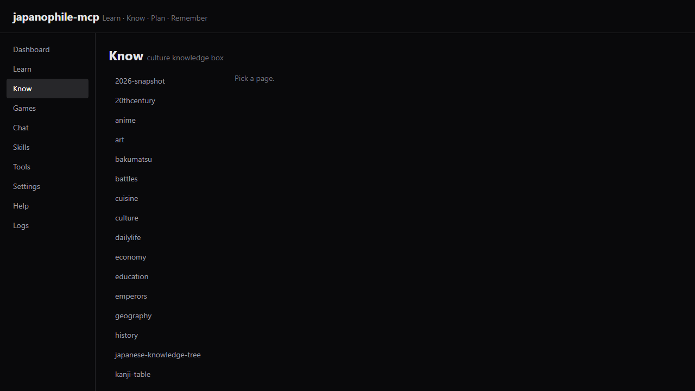
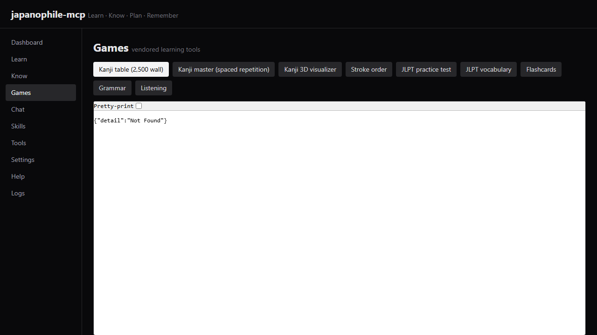
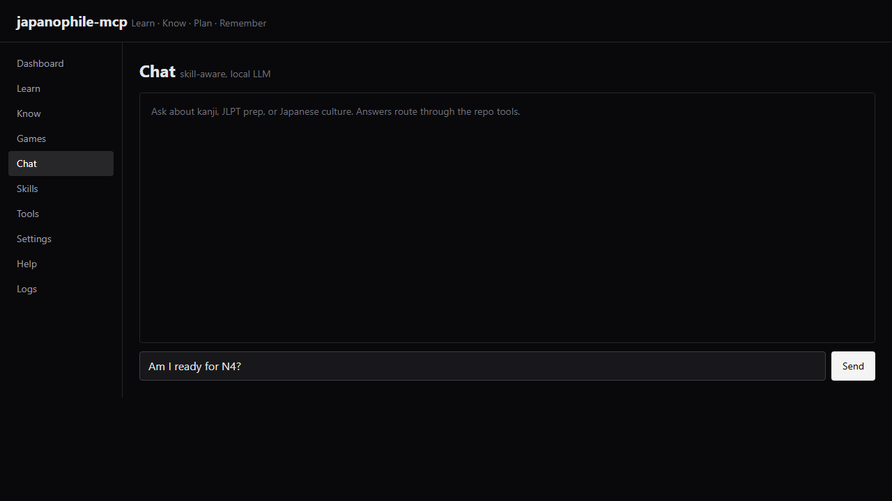

# japanophile-mcp

Your Japanophile workstation: kanji/JLPT learning tools, Japanese culture knowledge box, travel and diary on the roadmap. First **-phile repo** ([concept](https://github.com/sandraschi/sandraschi/blob/main/PHILE_FLEET.md)). Polite name on listings; working title was weeaboo, retired to joke status.

Ports: backend **11193**, frontend **11194** (Stage 2). Registered in `mcp-central-docs/operations/WEBAPP_PORTS.md`.

## Stage 1 (shipped): MCP server

Five tools, seeds vendored, big DBs fetched:

| Tool | Operations | Data |
|---|---|---|
| `kanji` | lookup, search, by_jlpt, by_grade, by_radical, random | assets/seed/kanji_database.db (13,108 kanji) |
| `jlpt` | next, answer, progress | assets/seed/jlpt_questions.db (600 Q + options) |
| `vocab` | search (400k vocab + jmdict), by_jlpt | data/kanji.db, fetched (135MB) |
| `knowledge` | list, get (29 pages) | assets/knowledge/japan/*.html |
| `japanophile_help` | tool + data status | - |

```json
{ "mcpServers": { "japanophile-mcp": {
  "command": "uv",
  "args": ["run", "--directory", "D:\\Dev\\repos\\japanophile-mcp",
           "python", "-m", "japanophile_mcp.server"] } } }
```

Big DBs: `pwsh -File scripts/fetch_data.ps1` copies kanji.db + wakan_vocab.json from an ai-games-collection checkout into data/ (gitignored). Tools degrade gracefully without them.

## Preview







## Inheritance

Learn tools (~15 html/js games), 29 knowledge pages, kanji/JLPT seeds, and two docs vendored from ai-games-collection (see docs/INHERITANCE.md). Canonical home for Japanese learning moves here; ai-games-collection keeps playable hanafuda/cho-han via crossconnect. Gamified frontends vendored as static assets under assets/games (self-contained, ~300KB) - no duplication of logic, they read the same seeds.

## Roadmap

- Stage 2: React webapp (catch-them-all) + chat/skills pages, Tauri NSIS winapp, .mcpb bundle.
- Travel planner + diary tools (new builds, mywienerlinien + email patterns).
- sinophile-mcp as proof the -phile pattern replicates.

Docs: [TOOLS](docs/TOOLS.md) - [CONFIGURATION](docs/CONFIGURATION.md) - [INHERITANCE](docs/INHERITANCE.md) - [INSTALL](INSTALL.md)
